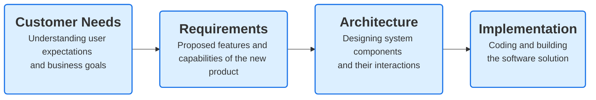
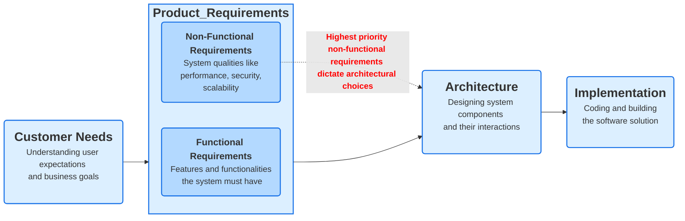

# Embedded linux in product development context

This page aims to clarify when to use embedded linux as system platform, what are the key alternatives and how the decision making process is supposed to happen.  

## Device Type and OS Selection (Bare-Metal, RTOS, Linux)

The choice between bare-metal, RTOS, or Linux depends on the complexity, real-time requirements, power constraints, and cost of the IoT device.

1. **Bare-Metal (No OS)**
- Use Case:
  - Ultra-low-power, resource-constrained devices.
  - Simple IoT devices with basic functionality (e.g., sensors, simple actuators).
- Pros:
  - Minimal overhead.
  - Fast boot time.
  - Very low power consumption.
  - Total control over hardware.
- Cons:
  - Difficult to manage complexity.
  - No multitasking.
  - Harder to update/maintain.
- Examples:
  - Temperature sensors, motion detectors, humidity sensors.
2. **RTOS (Real-Time Operating System)**
- Use Case:
  - Devices requiring real-time behavior with predictable timing.
  - Slightly more complex IoT devices (e.g., gateways, industrial controllers).
- Pros:
  - Deterministic, real-time behavior.
  - Task scheduling and multitasking.
  - Power-efficient.
  - Easier to manage than bare-metal for complex applications.
- Cons:
  - Limited memory and processing power.
  - Can get complex as the system scales.
- Examples:
  - FreeRTOS, Zephyr, Mbed OS.
3. **Linux (or Other Full-Fledged OS)**
- Use Case:
  - High-performance edge devices or gateways.
  - Devices needing a network stack, file system, and containers.
  - AI/ML processing on the edge.
- Pros:
  - Full-featured, with access to drivers and libraries.
  - Easier development with a broad ecosystem.
  - Can run containers for modular, scalable software (e.g., Docker).
- Cons:
  - Higher power consumption.
  - Longer boot times.
  - Requires more resources (CPU, RAM, storage).
- Examples:
  - Raspberry Pi, Yocto-based builds, Ubuntu Core, BalenaOS.

## SW platform selection in product development process

Choosing the SW platform is an <b>architectural design decision</b>. Typical architectural decisions in an IoT system 
- Device OS (baremetal, RTOS, OS)
- Connectivity decisions (BLE, WiFi, LoRa, 5G, ZigBee etc)
- Communication protocols (MQTT, CoAP, HTTPS, WebSocket etc)
- Device vs Edge vs Cloud processing
- Security architecture (certificates, root of trust, ciphers, authentication services)

These architectural choices can be made in a systematical documented manner within product development flow. 

### From User Needs to Requirements

New products are usually spawned from the co-operation between marketing (understanding customer needs) and R&D (understanding technical possibilities). The planned product features and capabilities are documented as Technical Requirement Specification. There are two classes of requirements:

#### 1. <b>Functional requirements</b> 

Functional requirements define what the system should do — its core functionalities or features. These requirements describe the interactions between the system and its users, external devices, or other systems.
Characteristics of Functional Requirements

- Describes behavior or functionality of the system.
- Focuses on inputs, outputs, and processing.
- Tied to user stories or use cases.

Example functional requirements:
| Requirement | Description |
| ------ | -------- |
| Sensor Data Collection | The IoT device must read temperature data every 5 seconds. |
| Connectivity | The IoT device must connect to the cloud using Wi-Fi or MQTT protocol. |
| User Authentication |	The system must require user authentication to access the device dashboard. |
| Alert System | The system must send an alert if the temperature exceeds a certain threshold. |
| Over-the-Air (OTA) Updates | The system must support OTA firmware updates. |

#### 2. <b>Non-functional requirements</b> 

Non-functional requirements define how the system should work — its quality attributes, performance, and operational constraints. These are the underlying characteristics that ensure the system is usable, reliable, and scalable.
Characteristics of Non-Functional Requirements

- Describes the quality of the system.
- Often includes -ilities (e.g., scalability, maintainability, usability).
- Usually tied to system performance, security, and usability.

Non-functional Requirement Examples :
| Requirement | Description |
| ------ | -------- |
| Performance|The IoT device must process sensor data within 50ms.|
| Security|All communication between devices and the cloud must be encrypted using TLS.|
| Power Consumption|The device should consume less than 1mW in sleep mode.|
| Scalability|The system must handle 10,000 connected devices simultaneously.|
| Availability|The system should have 99.9% uptime.|
| Interoperability|The IoT device must support integration with third-party services using standard protocols like MQTT and CoAP.|

### From requirements to architecture

<b>Non-functional requirements dictate the architecture.</b> The system designer chooses 1-3 most important non-functional requirements and choses the architecture based on those.

### Example: IoT Device Product Development Flow

#### 1. Customer Needs  
The product development starts with identifying customer needs:

The customer wants a smart wearable IoT device that can monitor health metrics like heart rate, temperature, and blood oxygen levels in real-time.
The device must be compact, lightweight, and affordable, with seamless connectivity to a smartphone app.  
Key Customer Need: The device must operate continuously for at least 7 days on a single battery charge.

#### 2. Requirements  
The next step is defining the product's requirements, which include both functional and non-functional requirements.

Functional Requirements:  
- The device must measure health metrics such as heart rate, temperature, and oxygen saturation.
- It must connect to a smartphone app via Bluetooth for data synchronization.
- It should send alerts to the user if any health metric exceeds a predefined threshold.  

Non-Functional Requirements:
- Power Consumption: The device must have extremely low power consumption to achieve a 7-day battery life.
- Size Constraints: The device must be compact and lightweight to be wearable.
- Cost: The device must be cost-effective for mass production.  

#### 3. Architecture
When designing the architecture, the team needs to choose between different hardware and software options.

Key Decision Point: The choice of operating system is critical.

The team initially considers using a Linux-based OS because:

- Linux is a well-established platform with many available drivers.
- It offers strong networking capabilities and multi-threaded support.  

However, after reviewing the non-functional requirements, especially the power consumption requirement, the team realizes a problem with Linux:
A Linux-based OS would consume too much power, primarily due to its complex kernel and multitasking capabilities. It would drastically reduce battery life to only 1-2 days, far below the 7-day requirement.

Implementation
Based on the non-functional requirements, the team makes a key architectural decision to use FreeRTOS, a lightweight real-time operating system (RTOS), instead of Linux.

Why FreeRTOS?

- Extremely low power consumption: FreeRTOS can operate in low-power sleep modes, significantly reducing energy usage.
- Small footprint: FreeRTOS is lightweight and requires minimal resources.
- Task prioritization: It allows real-time task scheduling, which is essential for managing sensor data efficiently.

Final Product: IoT Health Monitoring Device
The final product is a battery-powered wearable device that:

- Runs on FreeRTOS to meet the low-power requirement.
- Lasts for 7 days on a single charge.
- Connects via Bluetooth to a smartphone app for data synchronization.

**Key Takeaway: Non-Functional Requirements Drive Key Architectural Decisions**  
The highest priority non-functional requirement (power consumption) dictated the architectural choice to exclude Linux in favor of a low-power RTOS. This decision was crucial in ensuring the device met the customer’s battery life expectations.